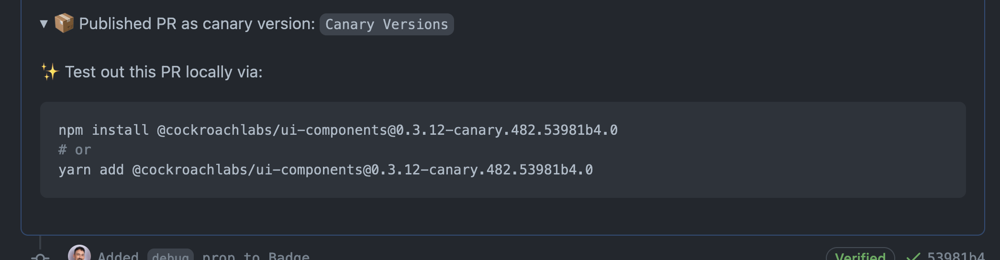

# How to contribute

## Clone the repo

```
> git clone https://github.com/cockroachdb/ui/
```

The UI repo is a monorepo managed by [Lerna](https://lerna.js.org/). Once you clone the repo, be sure to [bootstrap](https://github.com/lerna/lerna/tree/master/commands/bootstrap). _In the following examples, I'm using `npx`. If you do this very often you may consider installing Lerna globally (`npm i -g lerna`)._

```
> cd path/to/ui
> npx lerna bootstrap
```

## Fork and Develop

When contributing, we suggest contributors make a [personal fork](https://help.github.com/en/github/collaborating-with-issues-and-pull-requests/working-with-forks) to work with before submitting a [pull-request](https://help.github.com/en/github/collaborating-with-issues-and-pull-requests/proposing-changes-to-your-work-with-pull-requests).

## Style guidelines

### Class name prefixing

Since CSS modules provides the ability to scope class names to a particular module while also avoiding global classes we recommend composing class names in the most semantic and straigtforward manner possible, in particular avoiding repo- or package-prefixing.

```
// Good
.button { // ... }

// Bad
.crl-button { // ... }

.ui-components-button { // ... }
```

For more context on how we compose class names in general, see the [objectToClassNames](https://github.com/cockroachdb/ui/blob/master/packages/ui-components/src/utils/objectToClassnames.ts) utility function which expresses how we perform our mappings between component properties that are intended to impact the rendered visual and the module class names which support those visual changes.

## Automated Publishing

A [Github workflow](https://docs.github.com/en/actions/using-workflows/about-workflows) has been setup
[to automatically publish](https://github.com/cockroachdb/ui/blob/master/.github/workflows/release.yml) the packages of
this monorepo using [`auto`](https://intuit.github.io/auto/index). `auto` was created to publish code modules from a
continuous integration environment through pull request interaction. Publishing the packages in this repo is now as
simple as adding labels to a pull request and merging. Each pull request will have a canary version published for testing.
Semantic version increases (patch, minor, or major versions) can be controlled by applying the appropriate label to your
pull request. Each time a version is published, a new [release](https://github.com/cockroachdb/ui/releases) will be created
as well as [tags](https://github.com/cockroachdb/ui/tags) for each published package.

### Branching vs Forking
It is important to note that the [Release workflow](https://github.com/cockroachdb/ui/blob/master/.github/workflows/release.yml)
uses [secrets](https://docs.github.com/en/actions/security-guides/encrypted-secrets) to access tokens necessary to
interact with pull requests and labels as well as publishing to npm. Most secrets are not accessible to the runner when
a workflow is triggered from a
[forked repository](https://docs.github.com/en/actions/security-guides/encrypted-secrets#using-encrypted-secrets-in-a-workflow).
This means that when a pull request is created from a fork, the pull request will not be updated with a canary release.
Version labels can still be applied and packages will still be published upon merging to master. If you would like to
test your changes with a canary release, make sure to create a branch from the `cockroachdb/ui` rather than a branch
from a forked repository.

### Canary Releases
When a pull request is created on a branch, the **Release** workflow will run and publish a canary version of the packages
that have changes in the pull request. The version will be in the form of `X.X.X-canary.yyy.shortSha.#` and have the
[distribution tag](https://docs.npmjs.com/cli/v8/commands/npm-dist-tag) "`canary`". Your PR description will be updated
with a `<details>` block with instructions for installing the canary version.



### Applying labels to Pull Requests

`auto` will look at the labels applied to pull request to make decisions about how to increase the version of packages
when publishing after a merge. `auto` is configured to only look at certain labels (labels prefixed with 🤖). Here are
the current labels and what they do,

|label           | description                                                                                                                        |
|----------------|------------------------------------------------------------------------------------------------------------------------------------|
|🤖 major        | increase the major version (i.e. - from 1.0.0 to 2.0.0). This is used to denote incompatible changes to the API of a package.      |
|🤖 minor        | increase the minor version (i.e. - from 0.1.0 to 0.2.0). This is used to denote added functionality (that is backward compatible). |
|🤖 patch        | increase the patch version (i.e. - from 0.0.1 to 0.0.2). This is used for bug fixes or refactoring that doesn't change the API.    |
|🤖 skip-release | preserve the current version. |

Once a label is applied to a pull request, the version will be published when the pull request is merged.

## ⚠️ Auto publishing cautions ⚠️

### "Merging Quickly"

One thing to be aware of is merging while a [Release job](https://github.com/cockroachdb/ui/actions/workflows/release.yml)
is currently publishing. This may lead errors and failed publish jobs. To ensure this does not happen, I suggest a
"look before you leap" approach of checking that a Release job isn't running before you merge. Read more about this
issue [here](https://intuit.github.io/auto/docs/welcome/quick-merge).

### Canary PR description failure
In testing these features I have occassionally run into the issue of creating a pull request, and then taking my sweet
time to edit my PR description, then noticing that it wasn't updated with a canary version. It sounds like this is a
[known to happen](https://github.com/intuit/auto/issues/481#issuecomment-563466150). If this happens you can re-run the
Release job or push another change to your pull request to update the PR description.
